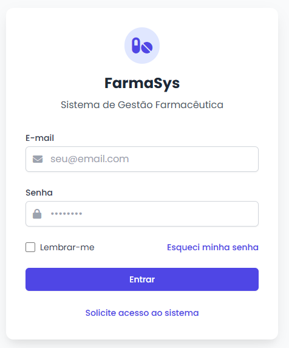
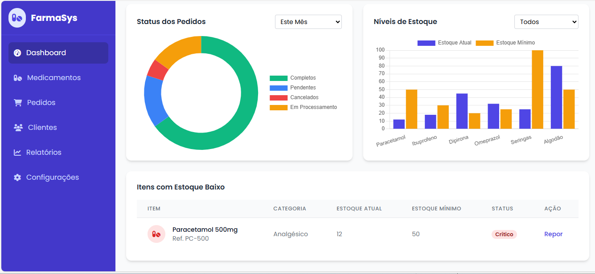
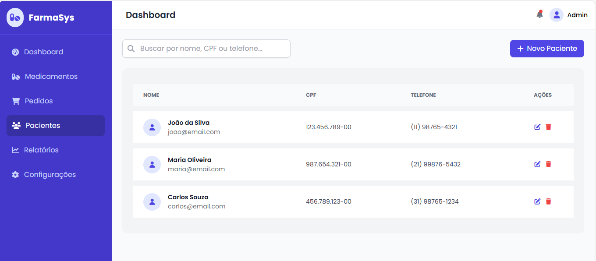

# 💊 FarmaSys - Gestão de Pacientes

**FarmaSys** é um sistema web de gestão de pacientes para farmácias de manipulação. A aplicação permite o cadastro, visualização e edição de pacientes, utilizando uma interface moderna construída com Django, Tailwind CSS e ícones FontAwesome.

## ✨ Funcionalidades

- Cadastro de pacientes com dados pessoais.
- Upload de prescrições médicas.
- Interface responsiva com design moderno.
- Componentes reutilizáveis (sidebar, header, modais).
- Edição e exclusão de registros.
- Busca por nome, CPF ou telefone.

---

## 🚀 Tecnologias Utilizadas

- [Python 3.10+](https://www.python.org/)
- [Django 4+](https://www.djangoproject.com/)
- [Tailwind CSS](https://tailwindcss.com/)
- [Font Awesome](https://fontawesome.com/)
- HTML5 + CSS3
- JavaScript (básico)

---

## 🛠️ Instalação e Execução

### 1. Clone o repositório

```bash
git clone https://github.com/Stanleykenneth/Sistema-Farmaceutico.git
cd farmasys
```

### 2. Crie e ative um ambiente virtual

```bash
python -m venv venv
source venv/bin/activate  # Linux/macOS
venv\Scripts\activate   # Windows
```

### 3. Instale as dependências

```bash
pip install -r requirements.txt
```

> Certifique-se de que o `Django` está listado no `requirements.txt`.

### 4. Rode as migrações iniciais

```bash
python manage.py makemigrations
python manage.py migrate
```

### 5. Crie um superusuário (opcional)

```bash
python manage.py createsuperuser
```

### 6. Inicie o servidor de desenvolvimento

```bash
python manage.py runserver
```

---

## 📁 Estrutura do Projeto

```
farmasys/
├── pacientes/
│   ├── templates/
│   │   ├── includes/         # sidebar.html, header.html
│   │   ├── partials/         # patient_table.html, patient_modal.html
│   │   └── pacientes.html    # Página principal
│   ├── static/
│   │   ├── css/pacientes.css
│   │   └── js/pacientes.js
│   └── views.py              # View principal
├── base.html                 # Template base
├── manage.py
└── requirements.txt
```

---

## 🧩 Modularização

- `base.html` → HTML base com blocos (``) para reaproveitamento.
- `includes/` → Componentes reutilizáveis (sidebar, header).
- `partials/` → Componentes de página (tabela, modal).
- `css/pacientes.css` → Arquivo CSS customizado com Tailwind.
- `js/pacientes.js` → Lógica de modais e interações.

---

## 📸 Interface

### Lista de Pacientes

> Imagem ilustrativa conforme protótipo ou screenshot do sistema.




---

## 📌 To-Do

- [ ] Integração com banco de dados real
- [ ] Upload real de arquivos para prescriptions
- [ ] Paginação e ordenação
- [ ] Validação com Django Forms

---

## 👨‍💻 Autor

Desenvolvido por **Kenneth Stanley Neves dos Santos**  
📧 kstanley_bass@hotmail.com
📱 11 98496.1691
